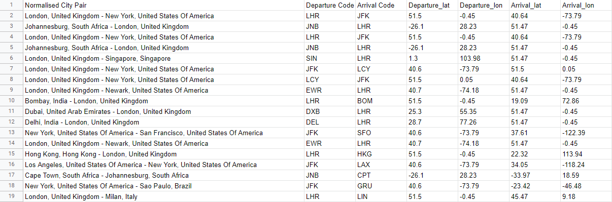
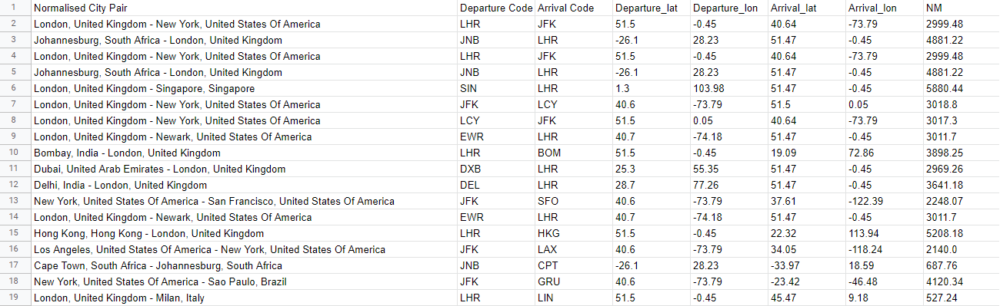

# This script calculates a distance in Nautical Miles (NM) from two given points (geographic coordinates) from a CSV file.

The script reads the CSV file as a dictionary and then calculate Nautical Miles in each row between two given points (arrival and departure airports).

## How to use
Run script calculate_routes.py. After this script create a new CSV file with calculated distances for each row. 
#### Input data CSV:
Input data is a CSV file which required at least 4 columns with specify name.


##### Important: for Arrival and Departure geographic coordinates use the following names:
```
Arrival_lat, Arrival_lon, Departure_lat, Departure_lon
```

#### Output file:
The output file is a CSV file with an additional column named 'NM' added at the end of each row.



### Used modules
```
csv, geopy
```
